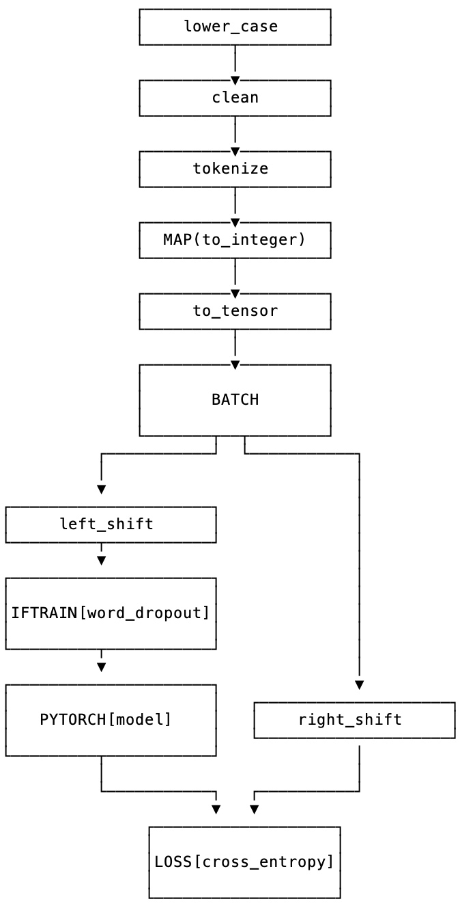
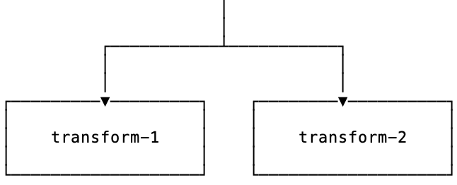

[](https://badge.fury.io/py/padl) 
 
[](https://pypi.org/project/padl/) 
[](https://pepy.tech/project/padl)
[](https://github.com/lf1-io/padl/issues)

**PyTorch** *abstractions for deep learning*.

---

Full documentation here: https://lf1-io.github.io/padl/

**PADL**:

- is a model builder for **PyTorch**. Build models with a functional API featuring operator overloading. Super fun and easy to use. Use **PADL** together with all of the great functionality you're used to with **Pytorch** for saving, and writing layers.
- allows users to build pre-processing, forward passes, loss functions **and** post-processing into the model
- models may have arbitrary topologies and make use of arbitrary packages from the python ecosystem
- allows for converting standard functions to **PADL** components using a single keyword `transform`.

**PADL** was developed at [LF1](https://lf1.io/) an AI innovation lab based in Berlin, Germany.

## Why PADL?

For data scientists, developing neural network models is often hard to coordinate and manage, due to the need to juggle diverse tasks such as pre-processing, **PyTorch** layers, loss functions and post-processing, as well as maintenance of config files, code bases and communicating results between teams. PADL is a tool to alleviate several aspects of this work.

### Problem Statement

While developing and deploying our deep learning models in **PyTorch**, we found that important design decisions and even data-dependent hyper-parameters took place not just in the forward passes/ modules but also in the pre-processing and post-processing. For example:

- in *NLP* the exact steps and objects necessary to convert a sentence to a tensor
- in *neural translation* the details of beam search post-processing and filtering based on business logic
- in *vision* applications, the normalization constants applied to image tensors
- in *classification* the label lookup dictionaries, formatting the tensor to human readable output

In terms of the functional mental model for deep learning we typically enjoy working with, these steps constitute key initial and end nodes on the computation graph which is executed for each model forward or backward pass.

### Standard Approach

The standard approach to deal with these steps is to maintain a library of routines for these software components and log with the model or in code which functions are necessary to deploy and use the model. This approach has several drawbacks.

- A complex versioning problem is created in which each model may require a different version of this library. This means that models using different versions cannot be served side-by-side.
- To import and use the correct pre- and post-processing is a laborious process when working interactively (as data scientists are accustomed to doing)
- It is difficult to create exciting variants of a model based on slightly different pre- and post-processing without first going through the steps to modify the library in a git branch or similar
- There is no easy way to robustly save and inspect the results of "quick and dirty" experimentation in, for example, jupyter notebooks. This way of operating is a major workhorse of a data-scientists' daily routine. 

### PADL Solutions

In creating **PADL** we aimed to create:

- A beautiful functional API including all mission critical computational steps in a single formalism -- pre-processing, post-processing, forward pass, batching and inference modes.
- An intuitive serialization/ saving routine, yielding nicely formatted output, saved weights and necessary data blobs which allows for easily comprehensible and reproducible results even after creating a model in a highly experimental, "notebook" fashion.
- An "interactive" or "notebook-friendly" philosophy, with print statements and model inspection designed with a view to applying and viewing the models, and inspecting model outputs.

With **PADL** it's easy to maintain a single pipeline object for each experiment which includes pre-processing, forward pass and post-processing, based on the central `Transform` abstraction. When the time comes to inspect previous results, simply load that object and inspect the model topology and outputs interactively in a **Jupyter** or **IPython** session. When moving to production, simply load the entire pipeline into the serving environment or app, without needing to maintain disparate libraries for the various model components. If the experiment needs to be reproduced down the line, then simply re-execute the experiment by pointing the training function to the saved model output. 

## Installation

```bash
pip install padl
```

## Project Structure

PADL's chief abstraction is `padl.transforms.Transform`. This is an abstraction which includes all elements of a typical deep learning workflow in **PyTorch**:

- pre-processing
- data-loading
- batching
- forward passes in **PyTorch**
- postprocessing
- **PyTorch** loss functions

Loosely it can be thought of as a computational block with full support for **PyTorch** dynamical graphs and with the possibility to recursively combine blocks into larger blocks.

Here's an example of what this might like:



The schematic represents a model which is a `Transform` instance with multiple steps and component parts; each of these are also `Transform` instances. The model may be applied in one pass to single data points, or to batches of data.

## Basic Usage

### Defining atomic transforms

Imports:

```python
from padl import this, transform, batch, unbatch, value
import padl
import torch
```

Transform definition using `transform` decorator. Any callable class implementing `__call__` can also become a transform:

```python
@transform
def split_string(x):
    return x.split()

@transform
class ToInteger:
    def __init__(self, words):
        self.words = words + ['<unk>']
        self.dictionary = dict(zip(self.words, range(len(self.words))))
        
    def __call__(self, word):
        if not word in self.dictionary:
            word = '<unk>''
        return self.dictionary[word]
   
to_integer = ToInteger(WORDS)

EOS_VALUE = to_integer.dictionary['</s>']
  
@transform
def to_tensor(x):
    x = x[:10][:]
    for _ in range(10 - len(x)):
        x.append(EOS_VALUE)
    return torch.tensor(x)  
```

`transform` also supports inline lambda functions as transforms:

```python
split_string = transform(lambda x: x.split())
```

`this` yields inline transforms which reflexively reference object methods:

```python
left_shift = this[:, :-1]
lower_case = this.lower()
```

**PyTorch** layers are first class citizens via `padl.transforms.TorchModuleTransform`:

```python
@transform
class LM(torch.nn.Module):
    def __init__(self, n_words):
        super().__init__()
        self.rnn = torch.nn.GRU(64, 512, 2, batch_first=True)
        self.embed = torch.nn.Embedding(n_words, 64)
        self.project = torch.nn.Linear(512, n_words)
        
    def forward(self, x):
        output = self.rnn(self.embed(x))[0]
        return self.project(output)
      
model = LM(N_WORDS)

print(isinstance(model, torch.nn.Module))                   # prints "True"
print(isinstance(model, padl.transforms.Transform))         # prints "True"
```

Finally, it's possibly to invoke all callables from an imported module as `Transforms` directly. This saves writing the transforms explicitly:

```python
import numpy
import torchvision

normalize = transform(torchvision).transforms.Normalize(*args, **kwargs)
cosine = transform(numpy).cos

print(isinstance(normalize, padl.transforms.Transform))         # prints "True"
print(isinstance(cosine, padl.transforms.Transform))            # prints "True"
```

### Defining compound transforms

Atomic transforms may be combined using 3 functional primitives:

Transform composition: **compose**


```python
s = transform_1 >> transform_2
```

Applying a single transform over multiple inputs: **map**


```python
s = ~ transform
```

Applying transforms in parallel to multiple inputs: **parallel**


```python
s = transform_1 / transform_2
```

Applying multiple transforms to a single input: **rollout**



```python
s = transform_1 + transform_2
```

Large transforms may be built in terms of combinations of these operations. For example the branching example above would be implemented by:

```python
preprocess = (
    lower_case
    >> clean
    >> tokenize
    >> ~ to_integer
    >> to_tensor
    >> batch
)

forward_pass = (
    left_shift
    >> IfTrain(word_dropout)
    >> model
)

train_model = (
    (preprocess >> model >> left_shift)
    + (preprocess >> right_shift)
) >> loss
```


### Passing inputs between transform stages

In a compose model, if `transform_1` has 2 outputs and `transform_2` has 2 outputs, then in applying the composition: `transform_1 >> transform_2` to data, the outputs of `transform_1` are passed to `transform_2` **positionally**. So output-1 of `transform_1` is passed to input-1 of `transform_2`. If `transform_2` has only one input, then the outputs of `transform_1` are passed as a tuple to `transform_2`.

In an upcoming release, we plan to allow for passing inputs from one stage to the next using input/ output names.

### Decomposing models

Often it is instructive to look at slices of a model -- this helps with e.g. checking intermediate computations:

```python
preprocess[:3]
```

Individual components may be obtained using indexing:

```python
step_1 = model[1]
```

### Naming transforms inside models

Component `Transform` instances may be named inline:

```python
s = (transform_1 - 'a') / (transform_2 - 'b')
```

These components may then be referenced using `__getitem__`:

```python
print(s['a'] == s[0])    # prints "True"
```

### Applying transforms to data

To pass single data points may be passed through the transform:

```python
prediction = t.infer_apply('the cat sat on the mat .')
```

To pass data points in batches but no gradients:

```python
for x in t.eval_apply(
    ['the cat sat on the mat', 'the dog sh...', 'the man stepped in th...', 'the man kic...'],
    batch_size=2,
    num_workers=2,
):
    ...
```

To pass data points in batches but with gradients:

```python
for x in t.train_apply(
    ['the cat sat on the mat', 'the dog sh...', 'the man stepped in th...', 'the man kic...'],
    batch_size=2,
    num_workers=2,
):
    ...
```

### "batch" and "unbatch" key transforms

The `batch` transform denotes where to split a transform between preprocessing and forward pass. The `unbatch` transform denotes where to split between forward pass and postprocessing. Everything before `batch` is performed in the data loader. This means that multiprocessing may be leveraged without extra boilerplate, to prepare data quickly for the forward pass. Every between `batch` and `unbatch` is performed on the GPU (is CUDA is being used) and in batches. Everything after `unbatch` downstream is applied in a for loop over the rows of output of the forward pass.

When using `Transform.infer_apply` to apply a transform to a single data point, the transforms `batch` adds the additional dimension which is otherwise created by batching in the data loader implicit in `Transform.train_apply` and `Transform.eval_apply`. Analogously, in `Transform.infer_apply` the unbatch transform serves to remove this additional dimension, so that the output going to the postprocessing step has the same number of dimensions as the rows which come out of the forward pass in `Transform.eval_apply` and `Transform.train_apply`. 

As a very simple example:

```python
m = transform(torch.nn.Linear)(10, 20)
t = (
  transform(lambda x: torch.tensor(x))
	>> batch
	>> m
	>> unbatch
	>> this.tolist()
)
```

`t.infer_apply(x)` is approximately equivalent to:

```
m(torch.tensor(x).unsqueeze(0))[0, :, :].tolist()
```

Whereas `t.eval_apply(x)` and `t.train_apply(x)` are approximately equivalent to:

```
[y.tolist() for y in m(torch.stack([torch.tensor(y) for y in x]))]
```

### Model training

Important methods such as all model parameters are accessible via `Transform.pd_*`.: 

```python
o = torch.optim.Adam(model.pd_parameters(), lr=LR)
```

For a model which emits a tensor scalar, training is super straightforward using standard torch functionality:

```python
for loss in model.train_apply(TRAIN_DATA, batch_size=BATCH_SIZE, num_workers=NUM_WORKERS):
    o.zero_grad()
    loss.backward()
    o.step()
```

### Saving/ Loading

Saving:

```python
from padl import save

save(model, 'test.padl')
```

Loading:

```python
from padl import load
model = load('test.padl')
```

For the full notebook see `notebooks/02_nlp_example.ipynb` in the GitHub project.

## Licensing

PADL is licensed under the Apache License, Version 2.0. See LICENSE for the full license text.
